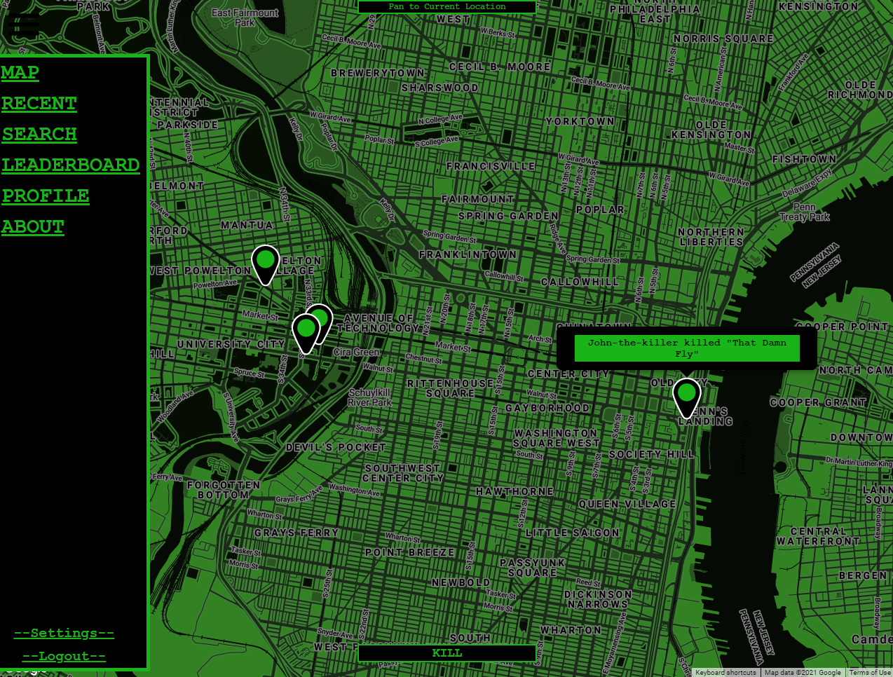

# LanternFall
A website aimed to raise awareness of the invasive species of lanternflies.
Users can sign up to view a map of their area. On the map, the user can see pins from other users.
These pins are posts from other users that signal the kill of a lanternfly. The user can post their kills with an image and text. That post will then show up on the map

# Website
* Website: [LanternFall.com](https://lanternfall.com/)
* Guest Email: guest@gmail.com
* Guest Password: guest

# Screenshots

# Built With
* Node.js
* Anime.js
* Postgres
* Cloudflare
* Google Cloud

# Authors
* Chris Lijoi
* John Dominguez
* Luke Matheson
* Oliver Nguyen
* Richard Vo
